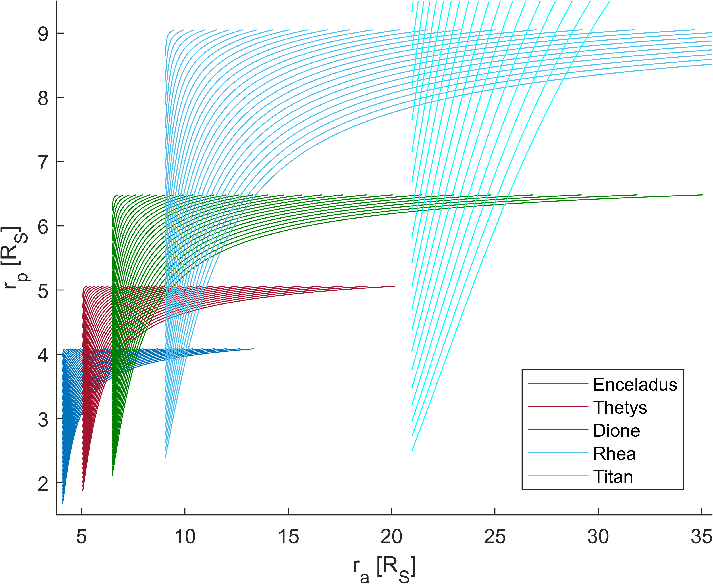
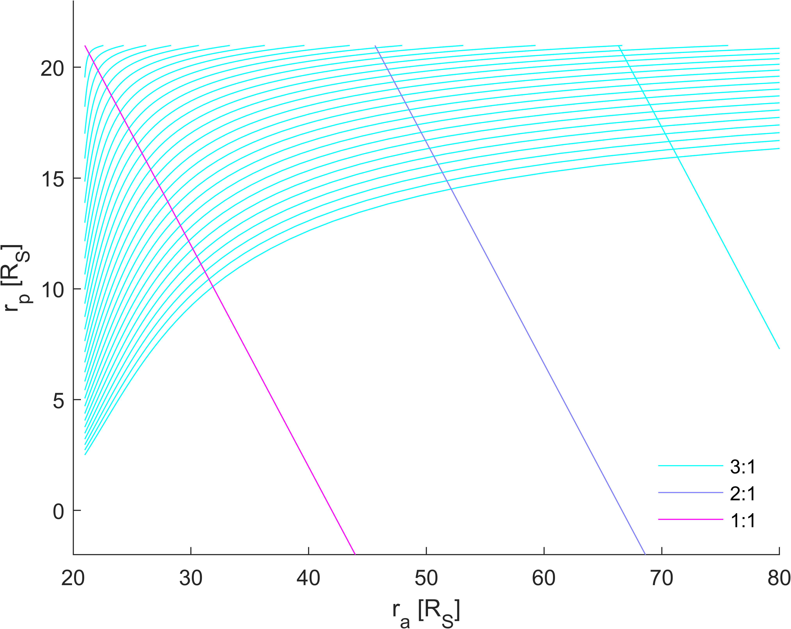
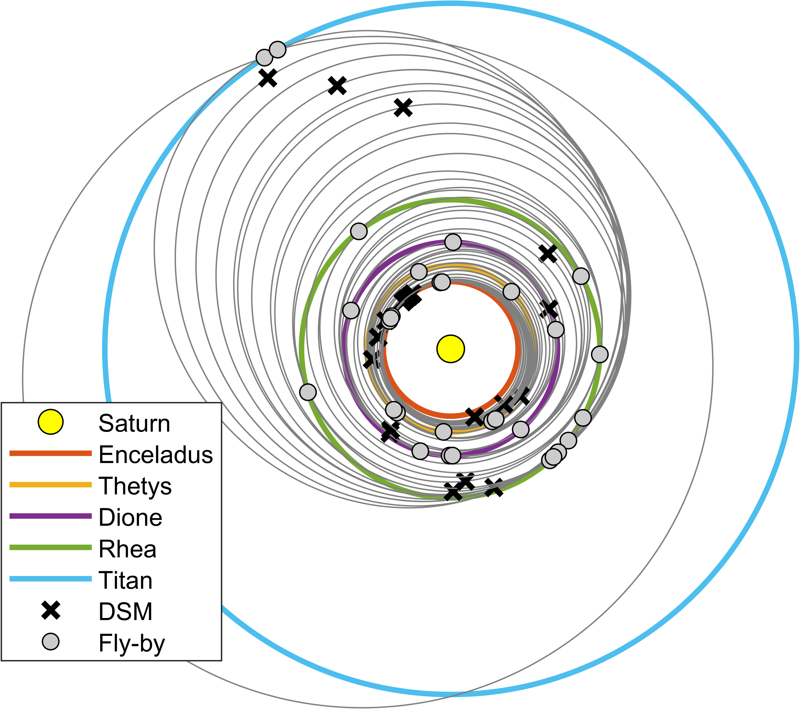

# Saturn moon tours using MATLAB
This folder contains AUTOMATE toolbox (100% MATLAB-based) for designing moon tours in Saturn system. AUTOMATE is meant to assess the feasibility of different moon tours using Tisserand graphs (TGs). The tours can include v-infinity leveraging transfers (VILTs), full-resonant and pseudo-resonant transfers, as well as intersections on the Tisserand graphs (i.e., transfer orbits between different moons). This project is the result of a collection of papers and theses. The main references are: Strange et al. [[1]](#1), Campagnola et al. [[2]](#2), Takubo et al. [[3]](#3), Bellome [[4]](#4) and Bellome et al. [[5]](#5).

The corresponding Python implementation can be found in ESA's MIDAS tool at:

```bash
https://midas.io.esa.int/midas/api_reference/generated/midas.design.tour.html
```

This readme.md shows how to install and run a full exploration for Saturn moon tours with test scripts provided.

## Installation & Requirements

To work with AUTOMATE, one can simply clone the repository in the local machine:

```bash
git clone "https://github.com/andreabellome/saturn_moon_tours.git"
```

Apart from AUTOMATE toolbox, a folder called 'Solutions' is also present with pre-computed solutions (namely, Pareto fronts and tours with best DV, given differtent input parameters).

Only invited developers can contribute to the folder, and each should create a separate branch or fork, otherwise push requests will not be accepted on main branch modifications. This work is under [CC BY-NC 4.0 DEED](https://creativecommons.org/licenses/by-nc/4.0/), i.e., Attribution-NonCommercial 4.0 International. See [LICENSE](https://github.com/andreabellome/saturn_moon_tours/blob/main/LICENSE) file for details.

To cite this software, please cite Bellome [[4]](#4) and Bellome et al. [[5]](#5).

One notices here that the [MATLAB Optimization Toolbox](https://it.mathworks.com/products/optimization.html) is required for the current version of AUTOMATE. Future developments will eliminate this need.

To run a full exploration of Saturn system, the following system requirements are recommended:
+ CPU six-core from 2.6 GHz to 3.6 GHz
+ RAM minimum 16 GB
+ Any version of [MATLAB](https://it.mathworks.com/products/matlab.html)>2021b with [Optimization Toolbox](https://it.mathworks.com/products/optimization.html) (this need will be eliminated in the future)

Python implementation requires less strict requirements (especially on RAM), but it also takes more computational time for a full Saturn exploration.

## Usage and test cases

To use the repository, one finds different test scripts. These are listed here:

1. Test script 1: [st0_tisserand_graph.m](https://github.com/andreabellome/saturn_moon_tours/blob/main/st0_plot_tisserand_graph.m), to plot TG for Saturn system. Refer to [this section](#Section_1).
2. Test script 2: [st1_database_generation.m](https://github.com/andreabellome/saturn_moon_tours/blob/main/st1_database_generation.m) to generate databases of VILTs and intersections on TG. Refer to [this section](#Section_2).
3. Test script 3: [st2_modp_exploration.m](https://github.com/andreabellome/saturn_moon_tours/blob/main/st2_modp_exploration.m) to perform a full exploration with DP. Refer to [this section](#Section_3).
4. Test script 4: [st3_phasing_problem.m](https://github.com/andreabellome/saturn_moon_tours/blob/main/st3_phasing_problem.m) to solve the phasing problem on different moons' transfers (i.e., intersections on TG). Refer to [this section](#Section_4).
5. Test script 5: [st_3_1_plot_phased_solution.m](https://github.com/andreabellome/saturn_moon_tours/blob/main/st_3_1_plot_phased_solution.m) to post-process a specific phased solution and plot it. Refer to [this section](#Section_5).

More details are provided in the following sections.

<a id="Section_1"></a> 

### Test script 1: Plot a Tisserand graph for Saturn system

This simple test script is used to plot a Tisserand graph for Saturn system. The reference script is [st0_tisserand_graph.m](https://github.com/andreabellome/saturn_moon_tours/blob/main/st0_plot_tisserand_graph.m).

It all starts by clearing the workspace and including the required libraries:

```matlab
%% --> select the INPUT

clear all; close all; clc; format long g;
addpath(genpath([pwd '/AUTOMATE']));
```

One then selects the central body and the flyby bodies (Saturn system is selected in this case, check also other options in [constants.m](https://github.com/andreabellome/saturn_moon_tours/blob/main/AUTOMATE/Ephemerides%20%26%20constants/constants.m)), as well as a list of infinity velocities [km/s].

```matlab
%% --> Plot contours of multiple moons

% --> set-up the system (Saturn in this case)
idcentral  = 6;             % --> Saturn is the central body (see constants.m)
IDS        = [ 1 2 3 4 5 ]; % --> Saturn moon IDs (see constants.m)
vinflevels = 0.1:0.1:3;     % --> infinity velocity levels [km/s]

% --> plot the Tisserand contours and add legend
nametosave = 'tisserand_graph_saturn_moons';
plotContours(IDS, vinflevels, idcentral, 0, 1, 1);
exportgraphics(gca, [pwd '/AUTOMATE/Images/' nametosave '.png'], 'Resolution', 800);
```

A Tisserand graph is then generated, and saved in [Images](https://github.com/andreabellome/saturn_moon_tours/tree/main/AUTOMATE/Images) folder, with a user-specified name. An image is provided.

<p align="center">
  
</p>

Axis are in Saturn radii [Rs].

One can then plot a single moon with highlighed resonances. Again a name to save is specified and the image is saved in [Images](https://github.com/andreabellome/saturn_moon_tours/tree/main/AUTOMATE/Images) folder. 

```matlab
%% --> plot contours of a single moon with resonances

id = 5; % --> Titan (see constants.m)

% --> plot the Tisserand contours
plotContours(id, vinflevels, idcentral);

% --> find resonant orbits
RES = findResonances(id, vinflevels, idcentral);

% --> plot resonances
plotResonances(IDS, RES, [], idcentral, 1);

nametosave = 'tisserand_graph_saturn_single_moon_resonances';
exportgraphics(gca, [pwd '/AUTOMATE/Images/' nametosave '.png'], 'Resolution', 800);
```

An example with Titan is provided. Legend shows the plotted resonant loci at Titan for the specified infinity velocities. One notices here that the resonances are specified in the function [resonanceList.m](https://github.com/andreabellome/saturn_moon_tours/blob/main/AUTOMATE/Tisserand%20graphs/Resonances/resonanceList.m). To change resonances at a given fly-by body, one simply modifies that script.

<p align="center">
  
</p>

<a id="Section_2"></a> 

### Test script 2: Generating databases of VILTs and intersections on Tisserand graph

The reference script described here is: [st1_database_generation.m](https://github.com/andreabellome/saturn_moon_tours/blob/main/st1_database_generation.m). This is used to generate a database of VILTs and intersections on TG for Saturn sytem.

It all starts by clearing the workspace and including the required libraries:

```matlab
%% --> select the INPUT

clear all; close all; clc; format long g;
addpath(genpath([pwd '/AUTOMATE']));
```

Then one can uncomment the following lines if parallel computing is preferred:

```matlab
% % --> parallel options
% delete(gcp('nocreate'));
% numWorkers = 6;
% parpool(numWorkers);
```

The following lines set-up the input parameters for computing a database of VILTs. For the terminology, the interested reader is referrd to Strange et al. [[1]](#1) and Bellome [[4]](#4). In particular, for moons' IDs and central body ID one can refer to [constants.m](https://github.com/andreabellome/saturn_moon_tours/blob/main/AUTOMATE/Ephemerides%20%26%20constants/constants.m).


```matlab
dtCode = tic; % --> start counting for computational time

% --> set up the search space
idcentral          = 6;                % --> central body (Saturn in this case)
IDS                = [5 4 3 2 1];      % --> planets IDs (Saturn moons in this case)
exterior_interior  = [+1 -1];          % --> +1 is exterior VILT, -1 is interior VILT
allowed_geometries = [ 88 81 18 11 ];  % --> allowed geometries for VILT
tolDV_leg          = 0.1;              % --> max. DSM magnitude (km/s)
tolDVmax           = 0.5;              % --> max. DSMtot magnitude (km/s)       
VILTS              = 1;                % --> (1) compute VILTS, (0) do not compute VILTS

tofDSM = 0; % --> min. days between flyby and manoeuvre
tofFB  = 0; % --> min. days between two flybys

% --> min. and max. vinf levels (km/s) at different moons
vinfMinMax  = [ 1.35	1.46     % --> at Titan
                0.850	1.85     % --> at Rhea
                0.750	1        % --> at Dione
                0.650	0.800    % --> at Thetys
                0.200	0.800 ]; % --> at Enceladus
stepSize    = 0.05; % --> vinf step size (km/s)
```

A for-loop is then launched over the moons' IDs, to generate a database of VILTs with the specified input.

```matlab
%% --> generate database of VILTs transfers

STRUC = struct( 'next_nodes', cell(1,length(IDS)) );
parfor ind = 1:length(IDS)
    
    ind

    % --> this line simply re-writes the input parameters accordingly
    inpt(ind) = prepareINPUTdatabase(idcentral, allowed_geometries, ...
        exterior_interior, tolDV_leg, vinfMinMax(ind,1), vinfMinMax(ind,2), ...
        stepSize, tofDSM, tofFB);

    pl                    = IDS(ind);
    next_nodes            = wrap_generateVILTSall(pl, inpt(ind));
    STRUC(ind).next_nodes = next_nodes;

end
LEGSvilts = cell2mat({STRUC.next_nodes}');
```

If no parallel is required, then one simply substitutes the line

```matlab
parfor ind = 1:length(IDS)
```

with

```matlab
for ind = 1:length(IDS)
```

Next step is to generate the databases of: 1) intersections on TG, and 2) the maximum deflection angles at moons for the specified infinity velocities.

```matlab
%% --> generate database of INTERSECTIONS and of MAX. DEFLECTION

vinflevels               = uniquetol(cell2mat({inpt.vinflevels}'), 1e-7);

INPUT.idcentral          = inpt(1).idcentral;
INPUT.allowed_geometries = inpt(1).allowed_geometries;
INPUT.exterior_interior  = inpt(1).exterior_interior;
INPUT.tolDV_leg          = inpt(1).tolDV_leg;
INPUT.tolDVmax           = tolDVmax;
INPUT.vinflevels         = vinflevels;

% --> find all possible intersections between different SS planets
LEGS_inter = findIntersectionPlanets(IDS, vinflevels, IDS, vinflevels, idcentral);

% --> find all possible max. deflections for SS planets
DELTA_MAX  = findDeltaMaxPlanets(IDS, vinflevels, idcentral);

% --> find all possible resonant orbits for planets and contours
RES        = findResonances(IDS, vinflevels, idcentral);

INPUT.VILTS       = VILTS;
INPUT.LEGSvilts   = LEGSvilts;
INPUT.LEGS_inter  = LEGS_inter;
INPUT.DELTA_MAX   = DELTA_MAX;
INPUT.IDS         = IDS;
INPUT.RES         = RES;
INPUT.vinflevels  = vinflevels;

dtCode = toc(dtCode); % --> total computational time
```

Finally, one saves the workspace with a user-defined name (please modify accordingly). Be careful that this name matches the one that is used in next test case (i.e., TG exploration). Notice that all the relevant variables are saved in a structure called ```INPUT``` that will be used in next scripts.

```matlab
% --> choose a name and save the databases
save -v7.3 wksp_test_cleaned_noOp
```

With the given options and the recommended system requirements, the overall computational time should be **11.7 minutes**. One is now ready to launch the next test case. 

<a id="Section_3"></a> 

### Test script 3: Full exploration of Tisserand graph

The tours in Saturn system are assumed to be performed one moon at a time. This is why the following script [st2_modp_exploration.m](https://github.com/andreabellome/saturn_moon_tours/blob/main/st2_modp_exploration.m). is divided in different moon phases.

It all starts by clearing the workspace and including the required libraries:

```matlab
%% --> CLEAR ALL AND ADD AUTOMATE TO THE PATH

clear all; close all; clc; format long g;
addpath(genpath([pwd '/AUTOMATE']));
```

The databases are then loaded. Care should be taken, as the name of the .mat file loaded should be the same of the one used in the previous script:

```matlab
%% --> DATABASE AND INPUT

% --> load the database
load('wksp_test_cleaned_noOp.mat');

% --> clear variables that are not needed
clearvars -except INPUT;
```

One can then select names to save the final tour (best DV), and the Pareto front that will be generated:

```matlab
% --> select names to save the variables
nameParetoFront = 'outputParetoFront_noOpCon';
nameBestDVpath  = 'PATHph_noOpCon';
```

The input are then processed (for more details see [pruneINPUTlegsvilts.m](https://github.com/andreabellome/saturn_moon_tours/blob/main/AUTOMATE/Exploration/Pruning/pruneINPUTlegsvilts.m)). As it can be seen, one can select a wide range of different input, depending on the needs:

```matlab
% --> define the INPUT
INPUT.opt           = 2;     % --> (1) SODP, (2) MODP (suggested value: 2)
INPUT.BW            = Inf;   % --> Beam Width (suggested value: Inf)
INPUT.decrease      = 1;     % --> (1) IN Saturn System, (0) OUT Saturn System
INPUT.tolDVmax      = Inf;   % --> max. DV for the whole tour (suggested value: Inf)
INPUT.tolDV_leg     = 0.05;  % --> max. DV between two flybys (suggested value: 0.05 km/s)
INPUT.tofdmax       = 1100;  % --> max. TOF for the whole tour (suggested value: 1100 days)

% --> prune the LEGSvilts
INPUT = pruneINPUTlegsvilts(INPUT);
```

The different moon phases can then be initiated. One assumes to start from an equatorial Saturn orbit crossing Titan at a given infinity velocity [km/s] and pump angle [rad]. This is specified in the following variable `node = [ 5 deg2rad(50) 1.460 ]`. A node is made by the ID of the moon, the pump angle and the infinity velocity at the moon. A cost function is to be specified (see [costFunctionTiss.m](https://github.com/andreabellome/saturn_moon_tours/blob/main/AUTOMATE/Exploration/Cost%20functions/costFunctionTiss.m)).

```matlab
%% --> TITAN PHASE

% --> define the cost function 
INPUT.costFunction = @(LEGSnext) costFunctionTiss(LEGSnext);

% --> define the input for the phase
INPUT.pldep       = 5;       % --> departing planet/moon
INPUT.plarr       = 4;       % --> arrival planet/moon
INPUT.maxlegs     = 3;       % --> maximum number of legs per moon phase
INPUT.vinfArrOPTS = [0 Inf]; % --> v-infinity bounds for the plarr encounter (suggested value: [0 Inf])

% --> select the departing nodes
depNode  = [ 5 deg2rad(50) 1.460 ];
LEGS     = depNode2depRows(depNode);

dtCode = tic; % --> start to measure the efficiency of the code here
```

Tisserand graph exploration can then be launched and the output processed:

```matlab
% --> explore Tisserand graph
output = exploreTisserandGraph(LEGS, INPUT);

% --> take the output and find common nodes
outputNext = outLineByLine(output);

% --> prune
outputNext = pruneOutputNext(outputNext, INPUT);

% --> apply MODP on outputNext
[LEGS, outputNext] = apply_MODP_outNext(outputNext);
```

Variables `LEGS` and `outputNext` are needed for the next moon phase. This is the Rhea phase, that is reported below:

```matlab
%% --> RHEA PHASE

INPUT.pldep   = 4;   % --> departing planet/moon
INPUT.plarr   = 3;   % --> arrival planet/moon
INPUT.maxlegs = 17;

% --> explore Tisserand graph
output2    = exploreTisserandGraph(LEGS, INPUT);

% --> reconstruct the full path
outputNext = reconstructFullOutput(outputNext, output2, INPUT);

% --> apply MODP on outputNext
[LEGS, outputNext] = apply_MODP_outNext(outputNext);
```

The process is repeated for the other moons, i.e., Dione and Thetys:

```matlab
%% --> DIONE PHASE

INPUT.pldep   = 3;   % --> departing planet/moon
INPUT.plarr   = 2;   % --> arrival planet/moon
INPUT.maxlegs = 13;

% --> explore Tisserand graph
output2    = exploreTisserandGraph(LEGS, INPUT);

% --> reconstruct the full path
outputNext = reconstructFullOutput(outputNext, output2, INPUT);

% --> apply MODP on outputNext
[LEGS, outputNext] = apply_MODP_outNext(outputNext);

%% --> THETYS PHASE

INPUT.pldep       = 2;   % --> departing planet/moon
INPUT.plarr       = 1;   % --> arrival planet/moon
INPUT.maxlegs     = 13;

% --> explore Tisserand graph
output2    = exploreTisserandGraph(LEGS, INPUT);

% --> reconstruct the full path
outputNext = reconstructFullOutput(outputNext, output2, INPUT);

% --> apply MODP on outputNext
[LEGS, outputNext] = apply_MODP_outNext(outputNext);
```

At this point, variables `LEGS` and `outputNext` encode moon tours starting at `node = [ 5 deg2rad(50) 1.460 ]` and arriving at Enceladus. The last step remaining is the so-called endgame problem at Enceladus, i.e., a fly-by tour that leverages the infinity velocity to the minimum possible. The search is stopped when the moon is encountered with infinty velocity within the bounds specified in the variable `INPUT.vinfArrOPTS  = [ 0 0.25 ];`.

Another cost function is specified that considers the overall DV to reach Enceladus, plus a contribution due to the orbital insertion around the moon. Please, refer to [costFunctionTiss_endgameOI.m](https://github.com/andreabellome/MRPLP_DACE_python/blob/main/final_mrplp_j2_analytic.py).


```matlab
%% --> ENCELADUS PHASE

INPUT.h            = 100; % --> circular orbit altitude around Enceladus
INPUT.pldep        = 1;   % --> departing planet/moon
INPUT.plarr        = 1;   % --> arrival planet/moon
INPUT.maxlegs      = 15;
INPUT.vinfArrOPTS  = [ 0 0.25 ]; % --> min. and max. v-inf [km] VERY IMPORTANT TO BE SPECIFIED
INPUT.costFunction = @(LEGSnext) costFunctionTiss_endgameOI(LEGSnext, INPUT.idcentral, INPUT.plarr, INPUT.h);

% --> explore Tisserand graph
output2 = exploreTisserandGraph(LEGS, INPUT);

% --> on the last leg, only the Pareto fronts to common nodes are relevant
output2      = outLineByLine(output2);
[~, output2] = apply_MODP_outNext(output2);

% --> reconstruct the full path
outputNext = reconstructFullOutput(outputNext, output2, INPUT);
clear output2 LEGSvilts LEGS_inter LEGSc C DELTA_MAX;

dtCode = toc(dtCode); % --> computational time of the script
```
A post-processing step is added to compute the contribution due to the DV for orbit insertion:

```matlab
% --> compute the orbit insertion manoeuvre
for indou = 1:length(outputNext)
    outputNext(indou).dvOI = orbitInsertion(INPUT.idcentral, INPUT.plarr, ...
        outputNext(indou).vinfa, INPUT.h);
end
```

The variable `outputNext` finally encodes the full set of tours. With the given options and the recommended system requirements, the overall computational time should be **1.5 hours**.

Finally, one can extract the Pareto front for the whole set of tours and plot the preferred trajectories.

```matlab
% --> plot the Pareto front
close all; clc;

% --> extract the info from the set of tours
dvtot  = cell2mat({outputNext.dvtot}');
toftot = cell2mat({outputNext.toftot}');
vinfa  = cell2mat({outputNext.vinfa}');
dvOI   = cell2mat({outputNext.dvOI}');
dvSUM  = dvtot+dvOI;

% --> compute the final Pareo front
pf = paretoQS([ toftot dvSUM ]);
pf = pf';

% --> save the Pareto front
outputParetoFront = outputNext( pf(:,end) );
save(nameParetoFront, 'outputParetoFront', '-v7.3');

% --> plot the Pareto front
fig1 = figure('Color', [1 1 1]);
hold on; grid on;
ylabel('TOF - days'); xlabel('\Deltav - m/s');
plot( dvSUM(pf(:,end)).*1000, toftot(pf(:,end)), 'o', 'MarkerEdgeColor', 'Black', ...
    'MarkerFaceColor', 'Yellow', 'MarkerSize', 10, ...
    'HandleVisibility', 'off' );

% --> save the Pareto front
exportgraphics(gca, [nameParetoFront '.png'], 'Resolution', 1200);
```

One can then select a desired tour from `outputNext` variable and plot the Tisserand trajectory. The tour is saved in a variable called `PATHph` where each moon phase is specified.

```matlab
% --> extract the min. DV path
[minDV, row] = min( dvtot+dvOI );
tofminDV     = toftot(row);
path         = reshape(outputNext(row).LEGS(1,:), 12, [])';
dvpath       = sum( path(:,end-1) );
tofpath      = sum( path(:,end) );

% --> divide the path in different moon phases
PATHph = dividePathPhases_tiss(path, INPUT);
save(nameBestDVpath, 'PATHph', '-v7.3');

% --> plot trajectory on Tisserand map
plotFullPath_tiss(PATHph, INPUT);

% --> plot trajectory
INPUT.t0   = date2mjd2000([2033 12 21 0 0 0]);
[fig, dvc] = plotFullPathTraj_tiss(PATHph, INPUT);
```

The variable `PATHph` is then saved in the local folder with the name specified above and the trajectories are plotted. A Pareto front from the test script above is the following:

<p align="center">
  
</p>

Some notable solutions from the literature are presented. As it can be seen, dynamic programming application for Saturn moon tours preliminary design outperforms current available literature.


<a id="Section_4"></a> 

### Test script 4: Solving the phasing problem

This script solves the phasing problem between different moons for a given tour (e.g., computed with the above scripts). To solve the phasing problem the following assumptions are made:
* Lambert problems are solved over grids of initial tour dates and time of flight between different moons.
* Approximate DV manoeuvres, i.e., DV defects [[5]](#5), are used to compute the cost of a given leg.

Be careful that the current implementation of the phasing problem can take several hours due to high number of Lambert problems solved, database generations, and management of large matrices for tours' storage. Future developments should focus on managing these aspects. 

**Use this script carefully**.

It all starts by loading the desired tour form previous scripts:

```matlab
%% --> CLEAR ALL AND ADD AUTOMATE TO THE PATH

clear all; close all; clc; format long g;
addpath(genpath([pwd '/AUTOMATE']));
addpath(genpath([pwd '/Solutions']));

%% --> INPUT

% --> Step 0: select the central body and the input
idcentral  = 6; % --> Saturn
mu         = constants(idcentral, 1);
bw         = 100; % --> Beam Width (suggested value: 100)
checkSolar = 0;   % --> check solar conjunction events (put 1 to check)
tofDSM     = 0;   % --> min. days between flyby and manoeuvre
tofFB      = 0;   % --> min. days between two flybys

INPUT.idcentral = idcentral;
INPUT.h         = 100; % --> altitude for orbit insertion [km]

% --> Step 1: load the Pareto front and select a tour from it
load('outputParetoFront_noOpCon.mat');
indo   = 1;
PATHph = dividePathPhases_tiss(reshape(outputParetoFront(indo).LEGS(1,:), 12, [])', INPUT);
```

Then a grid of initial tour dates is selected and one iterates on it.

```matlab
% --> select a grid of initial tour dates and step size
step = 1; % --> step size [days]
TT0  = date2mjd2000( [2035 1 1 0 0 0] ):step:date2mjd2000( [2035 1 31 0 0 0] );

indtt = 1; % --> select a date

fprintf('Computing date %d out of %d \n', [indtt, length(TT0)]);

t0 = TT0(indtt); % --> initial tour date
```

At every moon phase, solutions from Lambert problem will provide new infinity velocity solutions at the next moon, so the database of VILTs should be recomputed with new values, similarly to [st1_database_generation.m](https://github.com/andreabellome/saturn_moon_tours/blob/main/st1_database_generation.m).

```matlab
% --> Step 2: find new database around the reference solution
indPhase                   = 1;  % --> 1. Titan phase, 2. Rhea phase, 3. Dione phase, 4. Thetys phase, 5. Enceladus phase
vinflevPrev                = []; % --> empty, since at Titan there are no previous legs
[INPUT, path, seq, transf] = ...
    generateVILTdatabaseRefSolution(PATHph, indPhase, vinflevPrev,...
    idcentral, tofFB, tofDSM);
% --> end Step 2: find new database around the reference solution
```

The new database is explored, similarly to [st2_modp_exploration.m](https://github.com/andreabellome/saturn_moon_tours/blob/main/st2_modp_exploration.m). A multi-objecive dynamic programming approach coupled with Beam Search is used to prevent the options to explode and become unmanageable.

```matlab
% --> Step 3: explore the new database
INPUT.pldep   = seq(1);
INPUT.plarr   = seq(end);
INPUT.maxlegs = size(path,1)-1;
depNode       = [ path(1,1) path(1,9:10) ];
LEGS          = depNode2depRows(depNode);
output2       = exploreTisserandGraph(LEGS, INPUT, transf); % --> explore Tisserand graph
% --> end Step 3: explore the new database

% --> start Step 3.1: apply BW on output2
output2 = MODP_MOBS_phasing(output2, bw, INPUT);
% --> end Step 3.1: apply BW on output2
```

Now the options for solving the Lambert problems for all the tours should be selected. These are essentially the time of flight bounds, the step size for time of flight grid, the max. number of revolutions for Lambert arcs, and the max. DV defect allowed for the phase. These are saved in a strucuture ```inphasing``` and then the phasing problem can be solved by calling [solvePhasingSatMoons.m](https://github.com/andreabellome/saturn_moon_tours/blob/main/AUTOMATE/Phasing%20problem/solvePhasingSatMoons.m)

```matlab
% --> Step 4: for every solution found, solve the phasing problem
inphasing.perct  = 1.5/100;   % --> percentage of orbital period of next moon for step size in TOF
inphasing.toflim = [ 10 45 ]; % --> min./max. TOFs [days]
inphasing.maxrev = 30;        % --> max. revs. for Lambert problem
inphasing.toldv  = 0.1;       % --> max. DV defect [km/s]

LEGS       = cell2mat({output2.LEGS}');
seqph      = [ path(end,3) path(end,1) ]; % --> moon sequence to solve the phasing
INPUT.t0   = t0;
outputNext = solvePhasingSatMoons(LEGS, INPUT, seqph, inphasing);
% --> end Step 4: for every solution found, solve the phasing problem
```

A step is added to post-process the output and check that everything is correct. If so, a message will be displayed.

```matlab
% --> Step 5: take the output and find common nodes
outputNext      = outLineByLine(outputNext);
[~, outputNext] = apply_MODP_outNext(outputNext);
LEGS            = cell2mat({outputNext.LEGS}');
checkPhasingIsCorrect(LEGS, INPUT, t0, inphasing); % --> check the phasing has been done correctly
% --> end Step 5: take the output and find common nodes
```

As optional step, one can check Earth-Sun-Saturn conjunction events and discard those tours that happen to have such conjunction within a tolerance (in the example below 175 deg is used).

```matlab
% --> Step 6: check solar conjunction (flybys)
INPUT.checkSolar = checkSolar;
INPUT.pl1        = 3;             % --> check solar conjunction with Earth (see constants.m)
INPUT.phaselim   = deg2rad(175);  % --> limit for conjunction event to occur
LEGS             = checkSolarConjunctionFlyby(LEGS, INPUT, inphasing);
% --> end Step 6: take the output and find common nodes
```

Now the next phase (in this case Rhea) can be initiated:

```matlab
%% --> Rhea phase

% --> create the new database around the reference solution for the new phase
indPhase                   = 2;                      % --> 1. Titan phase, 2. Rhea phase, 3. Dione phase, 4. Thetys phase, 5. Enceladus phase
vinflevPrev                = unique(LEGS(:,end-2))'; % --> these are the infinty velocities at the new moon
[INPUT, path, seq, transf] = ...
    generateVILTdatabaseRefSolution(PATHph, indPhase, ...
    vinflevPrev, idcentral, tofFB, tofDSM);
```

And the steps above are repeated up to the Step 6. This is done for all the phases.

If a phased solution is found, then the orbit insertion manoevure is computed and the new tour is saved in the variable ```PATHphNew```.

```matlab
% --> compute the orbit insertion manoeuvre
for indou = 1:length(outputNext)
    outputNext(indou).dvOI = orbitInsertion(INPUT.idcentral, INPUT.plarr, ...
        outputNext(indou).vinfa, INPUT.h);
end

dvtot  = cell2mat({outputNext.dvtot}');
toftot = cell2mat({outputNext.toftot}');
vinfa  = cell2mat({outputNext.vinfa}');
dvOI   = cell2mat({outputNext.dvOI}');
dvSUM  = dvtot+dvOI;

% --> extract the min. DV path
[minDV, row] = min( dvSUM );
tofminDV     = toftot(row);
path         = reshape(outputNext(row).LEGS(1,:), 12, [])';
dvpath       = sum( path(:,end-1) );
tofpath      = sum( path(:,end) );

% --> divide the path in different moon phases
PATHphNew = dividePathPhases_tiss(path, INPUT);
```

The solutions are stored in a structure called ```SOLUTION_PHASING``` where each row is a phased tour.

```matlab
SOLUTION_PHASING(indtt).t0         = t0;
SOLUTION_PHASING(indtt).PATHph     = PATHph;
SOLUTION_PHASING(indtt).PATHphNew  = PATHphNew;
SOLUTION_PHASING(indtt).outputNext = outputNext;
```

Assuming that one obtains a given ```SOLUTION_PHASING``` (e.g., check [SOLUTION_PHASING.mat](https://github.com/andreabellome/saturn_moon_tours/blob/main/Solutions/SOLUTION_PHASING.mat)), one can use the following script to plot the trajectory and all relevan information.

<a id="Section_5"></a> 

### Test script 5: Post-process a phased solution and plot

This script is used to post-process a ```SOLUTION_PHASING``` structure from previous script and to plot the corresponding trajectory.

It all starts by clearing the workspace and including the required libraries:

```matlab
%% --> CLEAR ALL AND ADD AUTOMATE TO THE PATH

clear all; close all; clc; format long g;
addpath(genpath([pwd '/AUTOMATE']));
addpath(genpath([pwd '/Solutions']));
```

One selects the central body (Saturn in this case), loads the ```SOLUTION_PHASING``` structure, selects a specified phased solution.

```matlab
% --> central body (Saturn in this case)
INPUT.idcentral = 6;

% --> load a phased solution
load('SOLUTION_PHASING.mat');

indsol = 5; % --> select a specific phased solution

% --> extract the info
t0        = SOLUTION_PHASING(indsol).t0;
PATHph    = SOLUTION_PHASING(indsol).PATHph;
PATHphNew = SOLUTION_PHASING(indsol).PATHphNew;
```

The post-processing function [extractVILTstrucPhasedAndPlot.m](https://github.com/andreabellome/saturn_moon_tours/blob/main/AUTOMATE/Phasing%20problem/Processing/extractVILTstrucPhasedAndPlot.m) is then used to extract all the relevant information about the tour (saved in a variable called ```VILTstruc```) and to plot the trajectory.

The following figure is generated.

<p align="center">
  
</p>

The output ```VILTstruc``` contains all the necessary information for performing further analysis on the specific phased solution. Please, refer to the description of [extractVILTstrucPhasedAndPlot.m](https://github.com/andreabellome/saturn_moon_tours/blob/main/AUTOMATE/Phasing%20problem/Processing/extractVILTstrucPhasedAndPlot.m).

## References
<a id="1">[1]</a> 
Strange, N. J., Campagnola, S., & Russell R. P. (2009). 
*Leveraging flybys of low mass moons to enable an Enceladus orbiter*.
Advances in the Astronautical Sciences. https://www.researchgate.net/publication/242103688_Leveraging_flybys_of_low_mass_moons_to_enable_an_Enceladus_orbiter.

<a id="2">[2]</a> 
Campagnola, S., Strange, N. J., & Russell R. P. (2010). 
A fast tour design method using non-tangent v-infinity leveraging transfer.
Celestial Mechanics and Dynamical Astronomy. https://doi.org/10.1007/s10569-010-9295-1.

<a id="3">[3]</a> 
Takubo, Y., Landau, D., & Brian, A. (2022). 
*Automated Tour Design in the Saturnian System*.
33rd AAS/AIAA Space Flight Mechanics Meeting, Austin, Texas, 2023 . https://arxiv.org/abs/2210.14996.

<a id="4">[4]</a> 
Bellome, A. (2023). 
Trajectory Design of Multi-Target Missions via Graph Transcription and Dynamic Programming.
Ph.D. Thesis, Cranfield University. https://dspace.lib.cranfield.ac.uk/handle/1826/20830.

<a id="5">[5]</a> 
Bellome, A., Sánchez, J. P., Felicetti, L., Kemble, S. (2023). 
Multiobjective Design of Gravity-Assist Trajectories via Graph Transcription and Dynamic Programming.
Journal of Spacecraft and Rockets. https://doi.org/10.2514/1.A35472.
